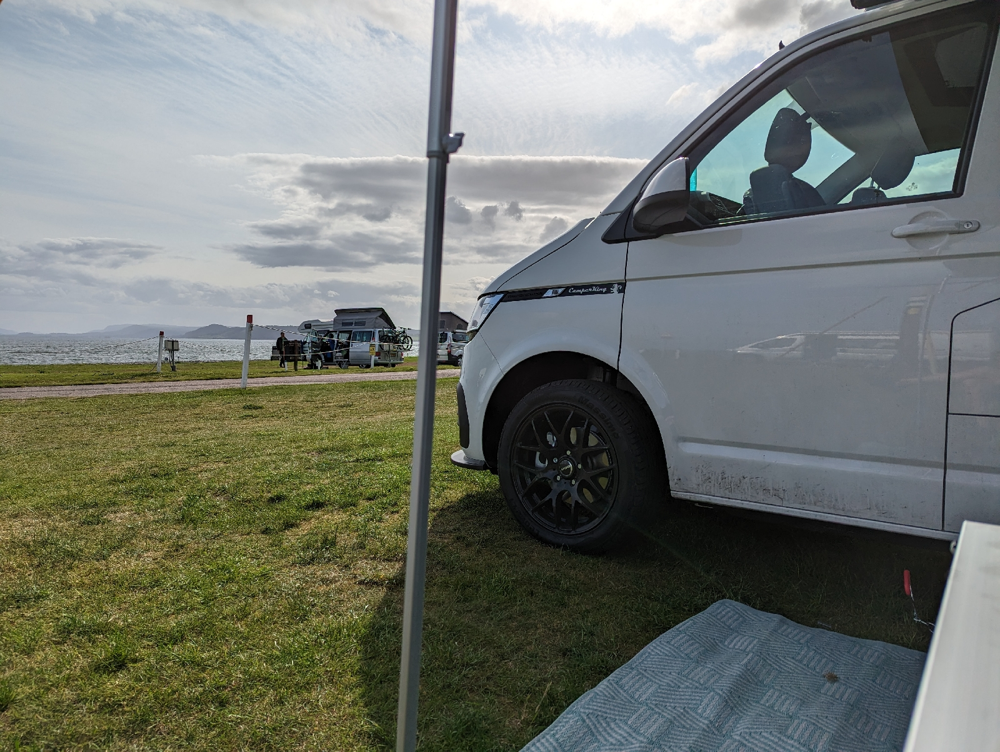
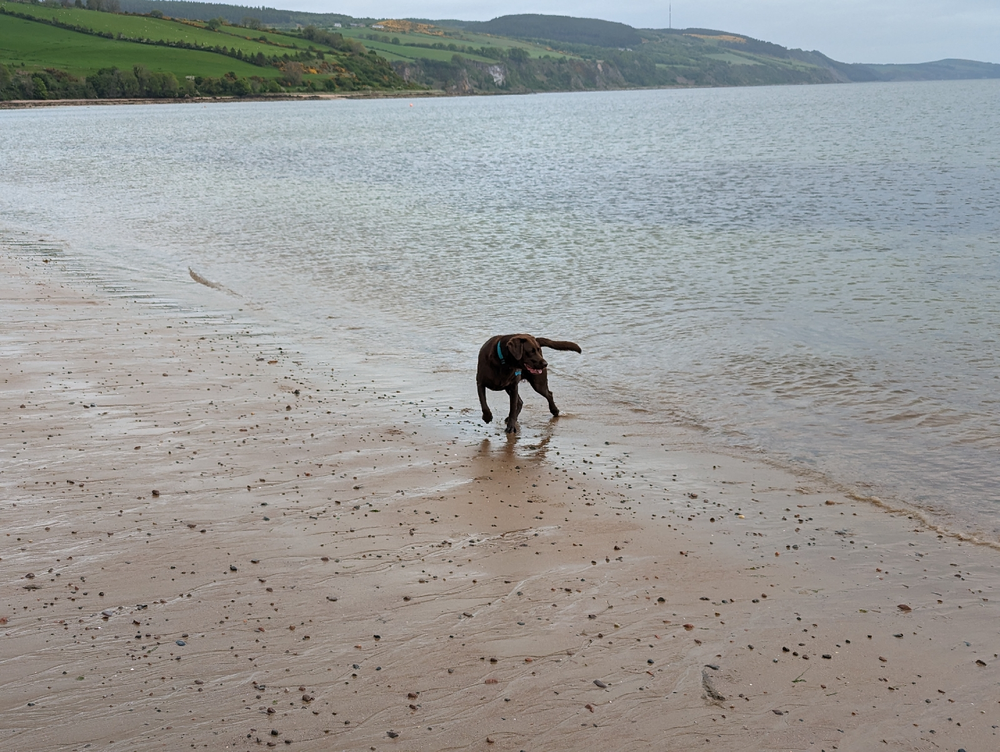
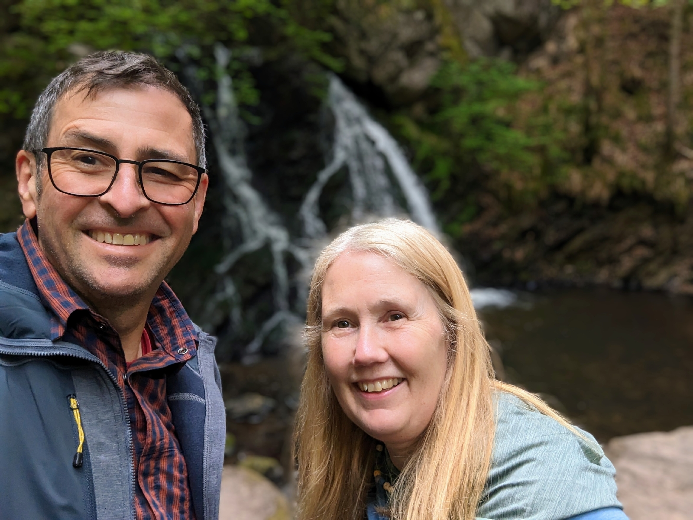
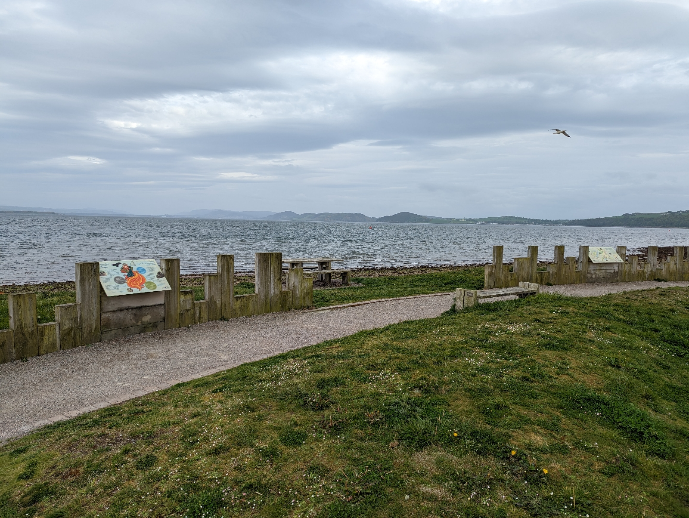
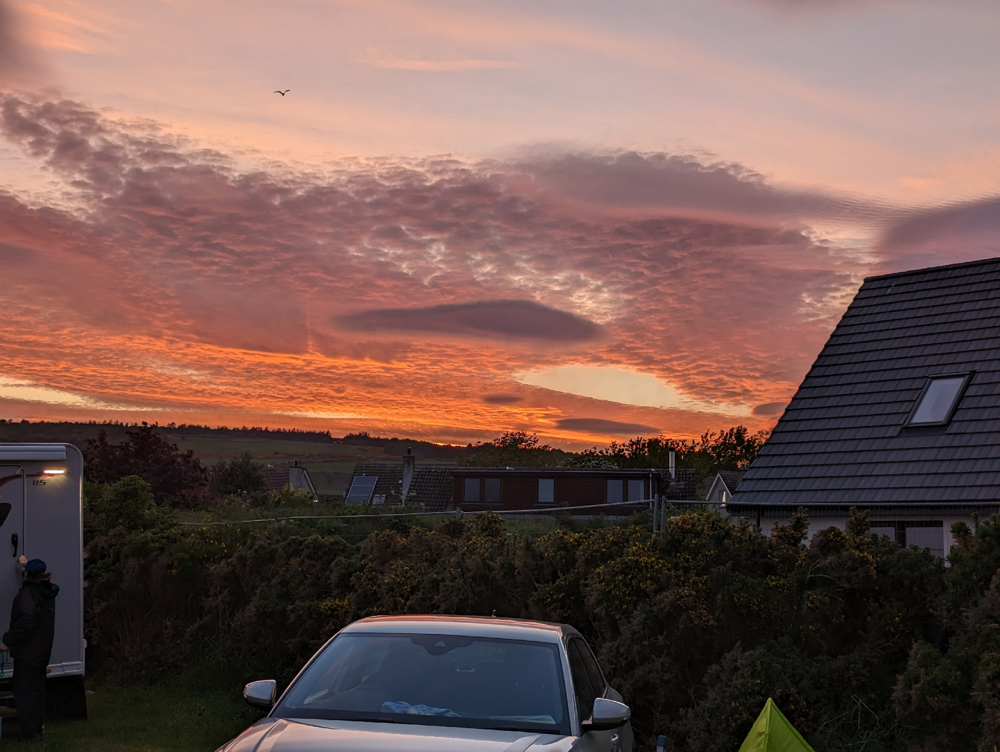

22nd-23rd May 2023

Second part of our 4 nights away.

What a lovely site, right on the beach (stones) with the waves blowing on, stunning sunset to the West.

Noted it was 1/2 the price of Rosemarkie that is 500m away on the other side of the point but with a sandy beach and more shelter from the prevailing westerly wind.

Cleo lived running on the beach and playing in the sea, continued on up the Fairie Glen to the waterfalls. Really nice sheltered walk, even saw the fairy houses at the start.

Fortrose Bay Campsite

01381 621927

<https://maps.app.goo.gl/VFAxBo6VEoNLqWSS7>
