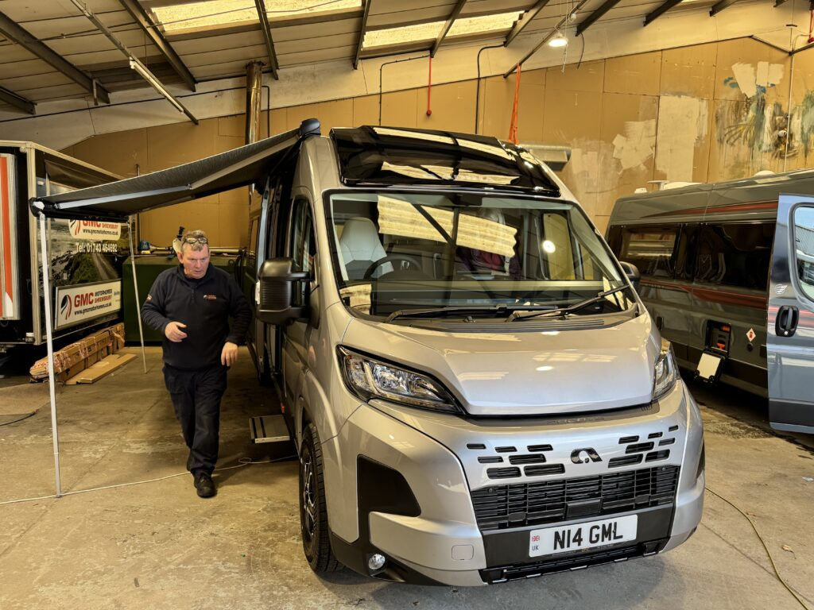

22nd April 2026

After 3 years, almost to the day, we have moved on from the VW CamperKing Monte Carlo and took delivery today of a brand new Adria Twin 640 SGX 60th Edition.

It was just getting a thought to go out to find the toilet block once or twice a night, so we have an onboard flushing loo with shower, hot water and hot air heater. Massive battery and solar so can basically off grid with the much larger fridge indefinitely in the summer.

Back in November we made the decision and put a deposit down at the big show at the NEC with GMC Motorhomes in Shrewsbury. It’s a good 6 hours drive but the cost to change was £7k better in our favour that going more local.

The pick up, exchange of the old van along was first rate, can’t fault it so far and working with GMC has been straightforward and very easy.

