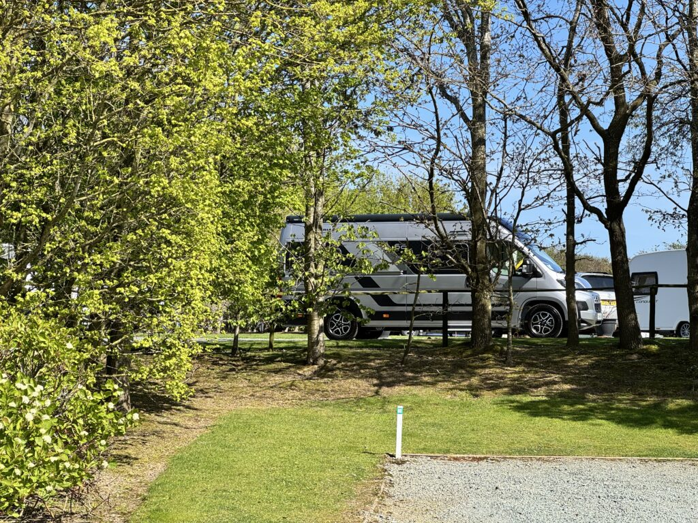
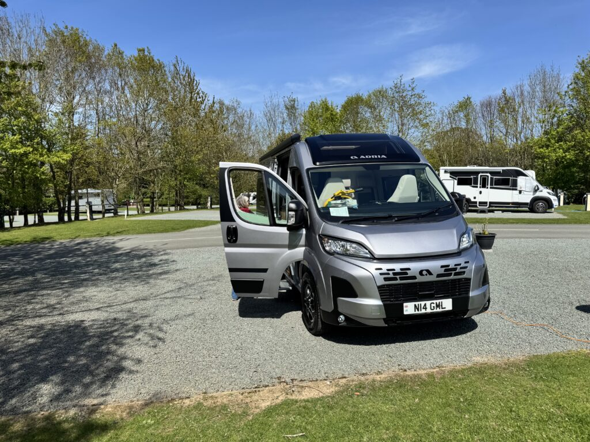

22nd-23rd April 2026

First night with the new van we stayed close to the dealership in case of any issues, that way we would nip back the following morning.

Only issue was is! We had forgotten to collect the extra bed for the dinning area before leaving, so 20 mins back in the morning.

The site Oxon Hall was run by a small group ( Morris Leisure) that has 6 sites in the nearby area (Chester to North Wales), absolutely spotless and really well stocked site shop with food and all sorts of spares for caravans and motorhomes.

Had dinner in the Grapes about 5 mins walk away which was good and great value.

The site is next to the Park and a ride for Shrewsbury, no noise but really handy to go into town (next time).

Driving across Shrewsbury it looks well worth a few days noising about

<https://maps.app.goo.gl/ZodFkHCjzkJbWzYq5?g_st=ic>

