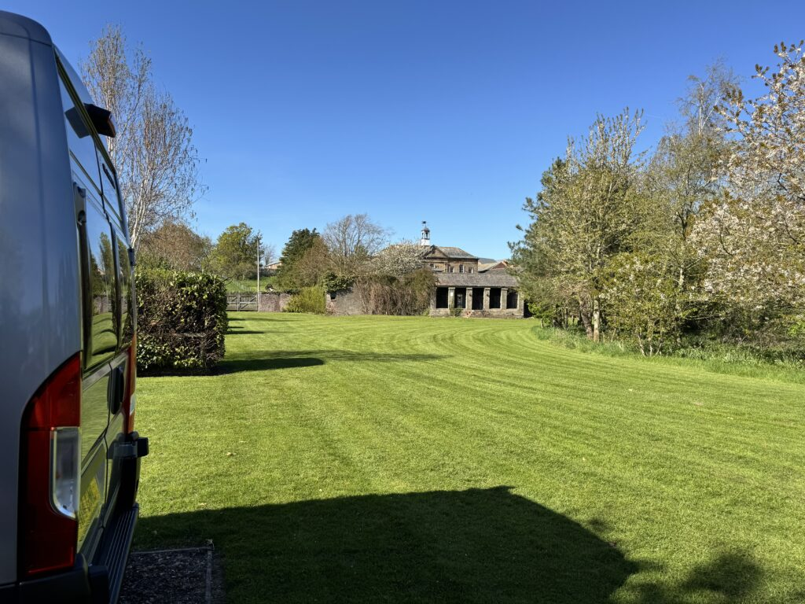
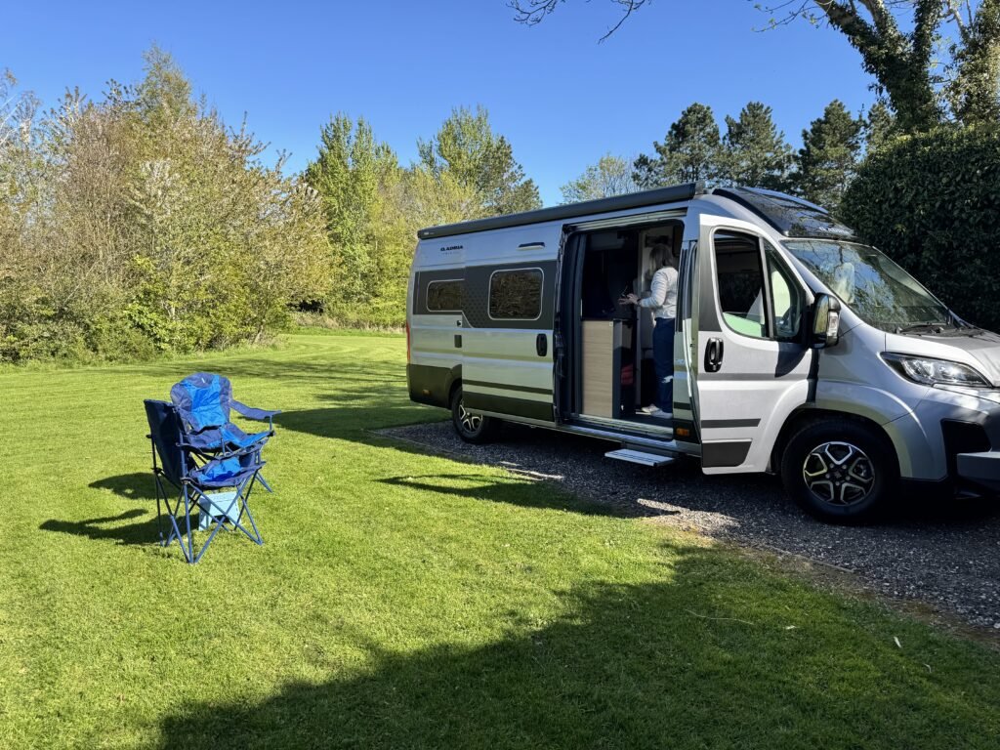
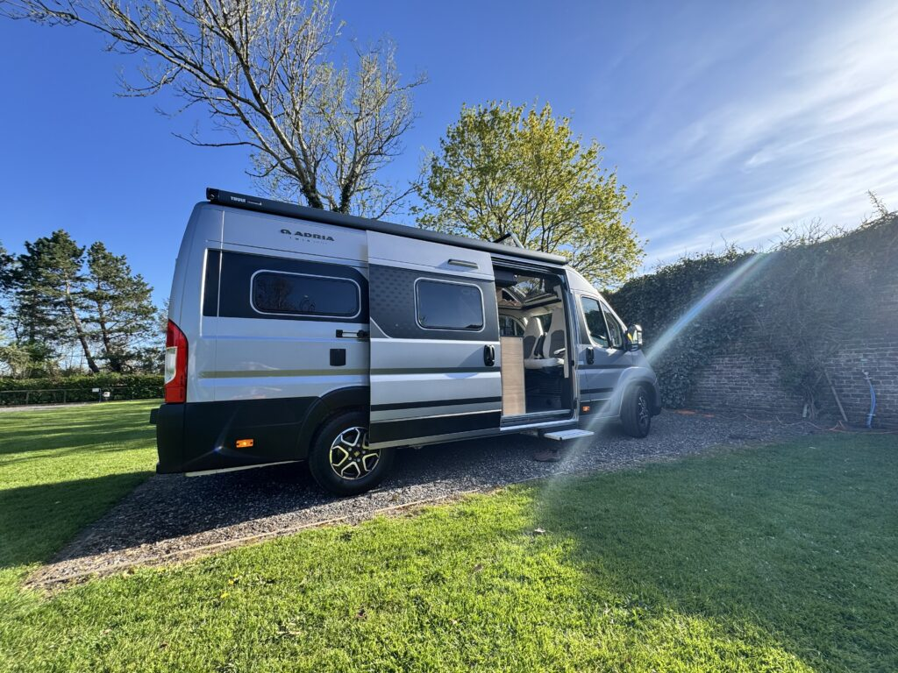
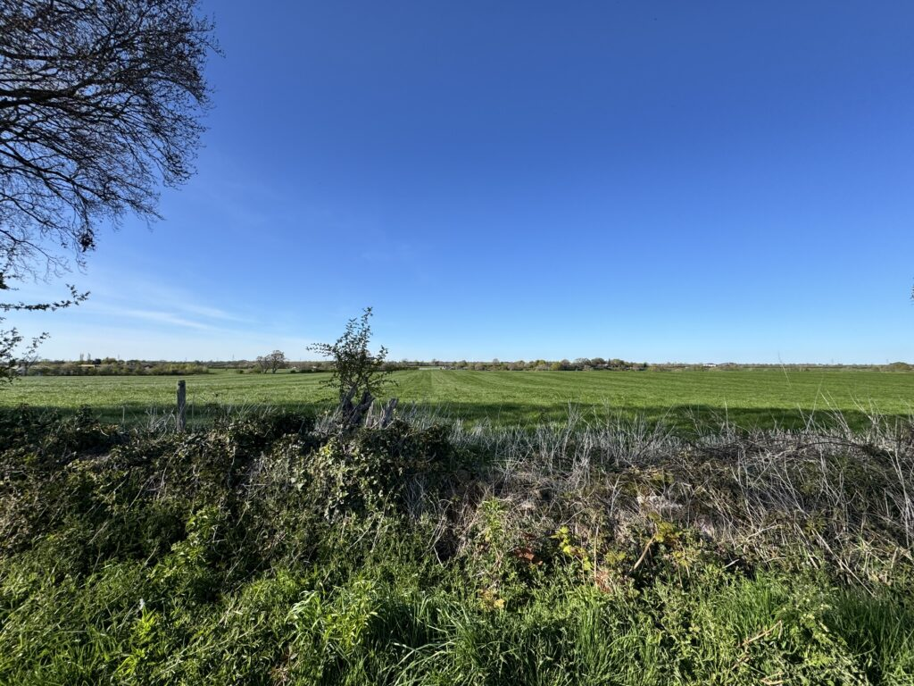

23rd-24th April 2026

Stop off on way back North, about 20 mins West of Carlisle in the walled garden of an old Manor House.

History of the place:

CROFTON HALL

Coffee shop

From the time of King John (1166 – 1216) there has been an estate at Crofton. In its day the estate featured Crofton Hall itself with adjacent stable blocks, beautiful walled gardens, gatehouses, deer park and lake; not to mention several estate farms and houses.

Sadly, the hall itself was demolished between 1955 – 1956. Many of the buildings are now listed and detailed on various English Heritage Websites should you wish to explore the history further.

The walled gardens can still be seen today as well as the icehouse. The estate is steeped in history and was the family seat of the Brisco family for 500 years. The motto of the Brisco family was “GRATA-SUME-MANU” which translates “Take with a grateful hand”. We feel it is a beautiful motto to follow.

Our coffee shop was built in part of the old stable block dating back to 1826. There are several local businesses within the stable block such as The Soul Space Holistic Centre, Glazed Expressions who sell beautiful, fused glass art, Enefftech UAV services which make drones. The nearby Crofton workshops house Evolve Yoga, Empower Personal Fitness Gym and Cotton Tails children’s clothing. Liquid Studios are a successful creative digital advertising and marketing agency situated in the upper level of the old clock tower and stable block, Crofton Hall Storage taking the lower level. Upland Clay Pottery has now moved into the site of the old Cheese farm. There is also Crofton Hall caravan park and Crofton fishing lake owned by Carlisle and District Coarse Angling Club.

Please feel free to have a look around whilst you are visiting the coffee shop and eatery.

Details of some of the businesses can be found on our leaflet stands. Samples of local produce, our own branded Farrah’s coffee, local art, and the history of the land settlement at Crofton books can be purchased within the coffee shop. See a member of stati about this.

We are a family run business, formerly of the Plough Inn Wreay until 2000. We pride ourselves on providing home cooked freshly prepared locally sourced food. We sincerely hope that you will enjoy your visit and come back to see us time and time again.

All meals are cooked fresh to order which will result in a wait for food. We are NOT a fast-food establishment, and we thank you for your patience during busy times. If you ave any food allergies, please inform staff before ordering so that we can advise on uitable dishes. If you have any queries about allergens on our menu, please ask.

<https://maps.app.goo.gl/dKnib5boyGgoNYYMA?g_st=ic>

Tip: Got to Carlisle junction rather than 41 when coming from the South, easier drive in
