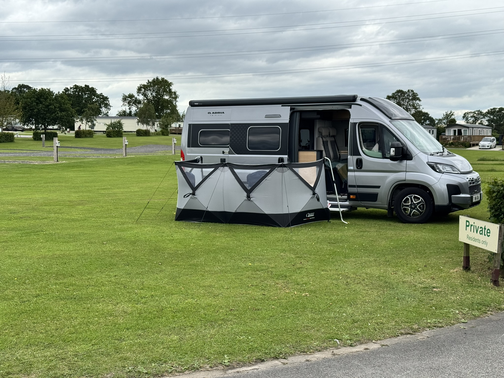
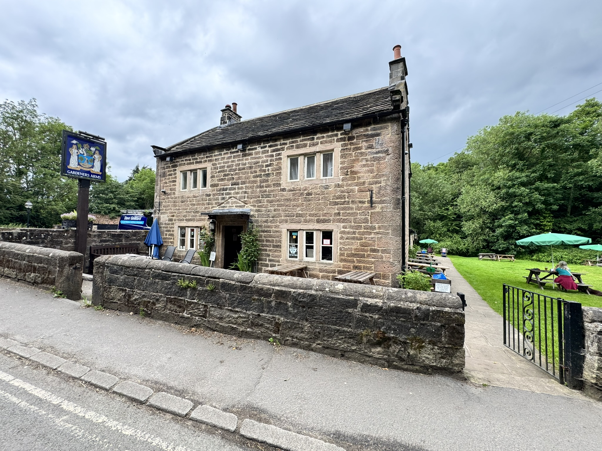
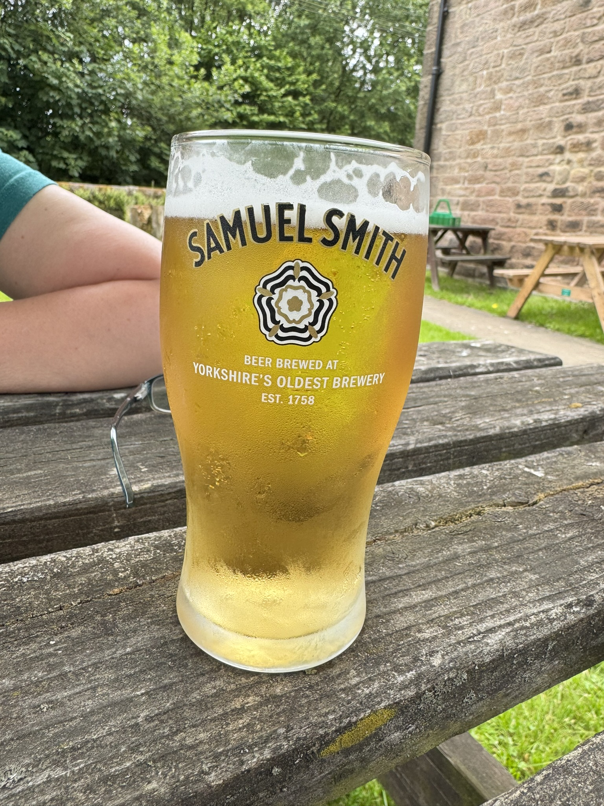
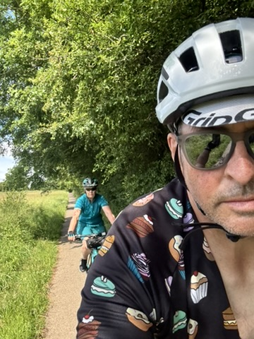
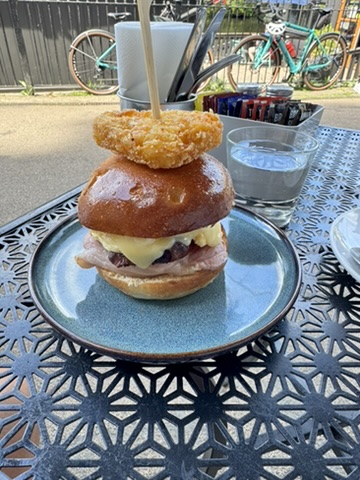
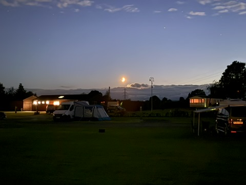

18-19th June 2026

Had originally planned to go to the Lakes on the way back from Scotland but the forecast on the West coast was heavy rain. At random we decided on Harrogate and booked into Bilton Park just on the North edge of the city.

Great facilities, very clean and endless high pressure showers!

Wandered down to the local Pub that is run the Yorkshire brewer Samual Adams, house rules, no phones, no dogs inside (also no food except their pwn brand of snacks) so we sat outside with Cleo and hid under an umbrella for a short rain shower.

The pub only sold their own beers, but that included 3 styles of larger that it would hev been rude not to try all of them. Went back the next evening and tested the Ales :-) as well.

