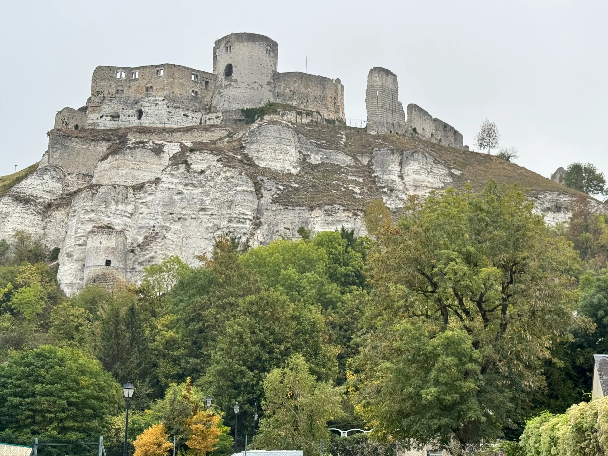
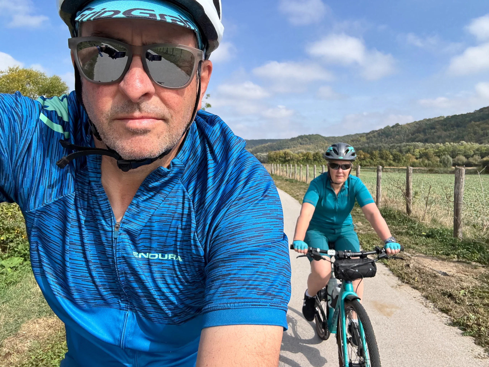
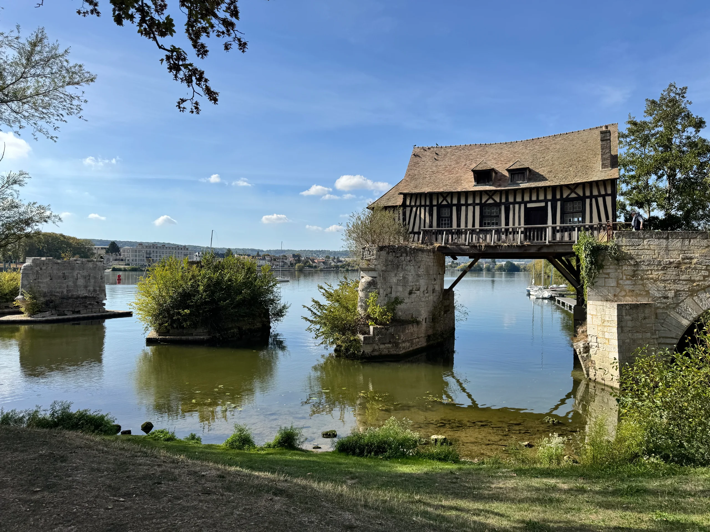
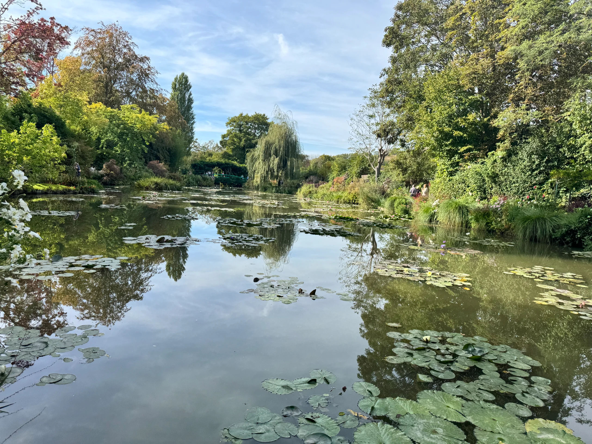

12 hours drive from the Fat Lamb including the channel crossing and we are at the first site in France.

Two nights here, by the river Sienne, a big site but in a shaded bay between hedges.

Had a pizza and beer at the onsite cafe once we had setup followed by sitting outside the van in the warm dark evening.

In the morning walked up to Chateau Gaillard that Richard The Lion Heart built and in the afternoon cycled a 40 mile round trip to Monets house and gardens with the famous lily pond.

