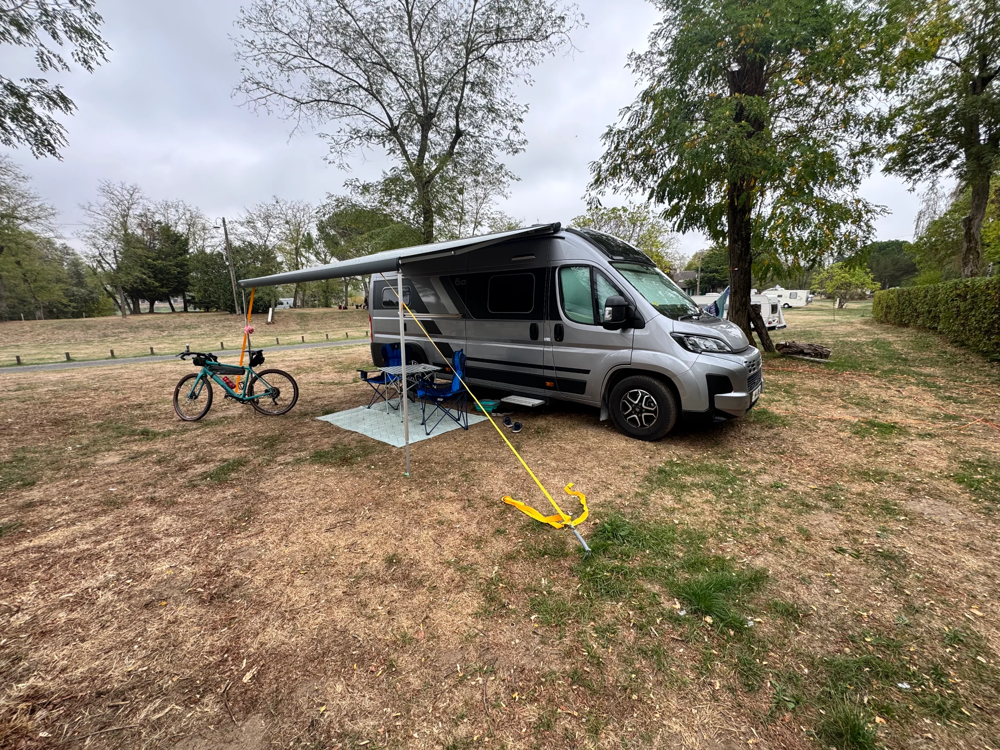
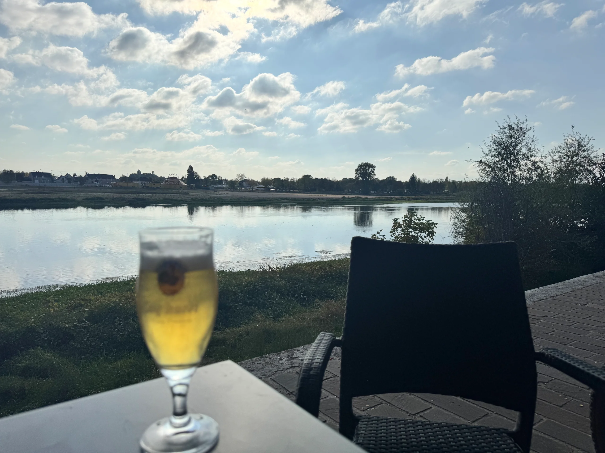

25 to 28 September 2026

Met up with the Milfords for the weekend, nice quiet site with a lovely restaurant on site.

It was a long drive down and we did not arrive until almost 5, so a chilled evening chatting.

On the Saturday Ian and I cycled to Briare whilst the girls went into town. Briare was hosting a Bouchon (traffic jam) on the Sunday, go figure.

The Bouchon was basically an old car rally based around the massive traffic jams that used to occur on the N7 road when the summer holidays started and the population on the North went south for the sun.

About 100 old cars (mostly French but a few MG’s and Mercedes) had gathered some with caravans and lots of people dressed in 50/60/70s clothes.
