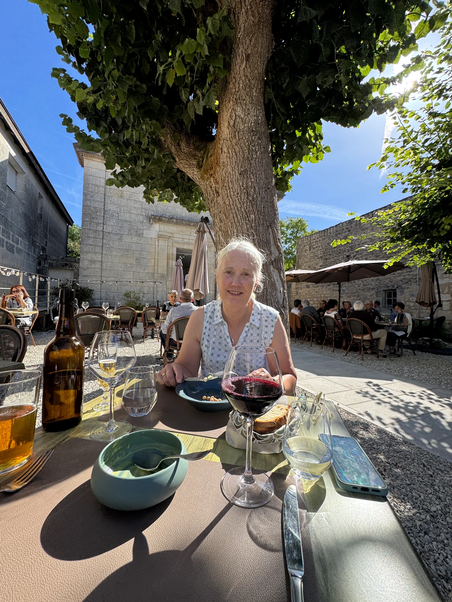
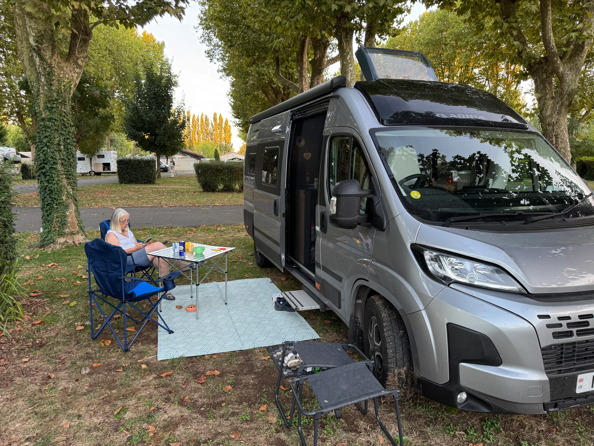

1-3rd October 2026

Having left Graeme and Sandra’s in the Plazac we headed North to a small town east of Rockford.

The site is by a small sports lake with paddle boarding, canoes etc. Setup then moved as we found that part of the site had no power since the thunderstorm storm the days before.

Had a walk about and settled in for the evening, next morning felt cool in the shade but in fact was perfect for a cycle. Went to the next town over Saint Savinien and stumbled across a fantastic little restaurant The Temple for lunch.

Overall 44km including a wander into our town and found the old squares and a few drinks in the late afternoon sun.

