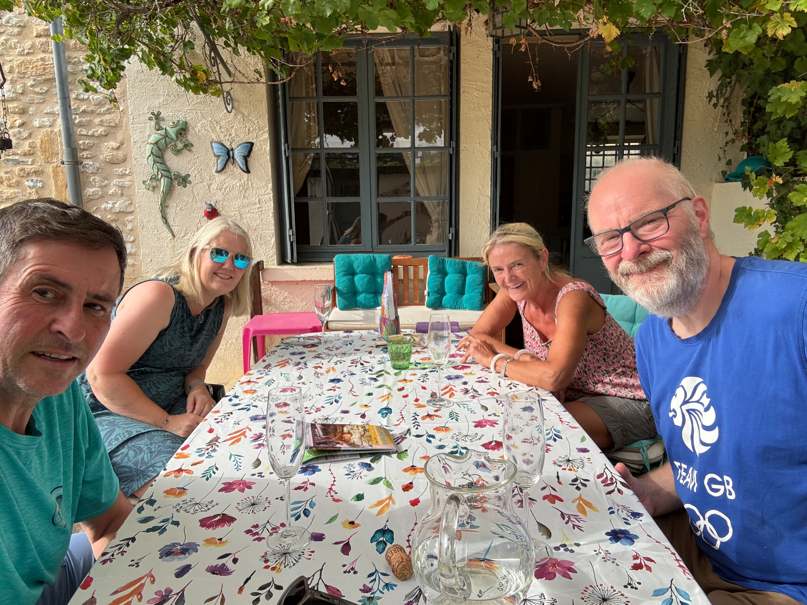
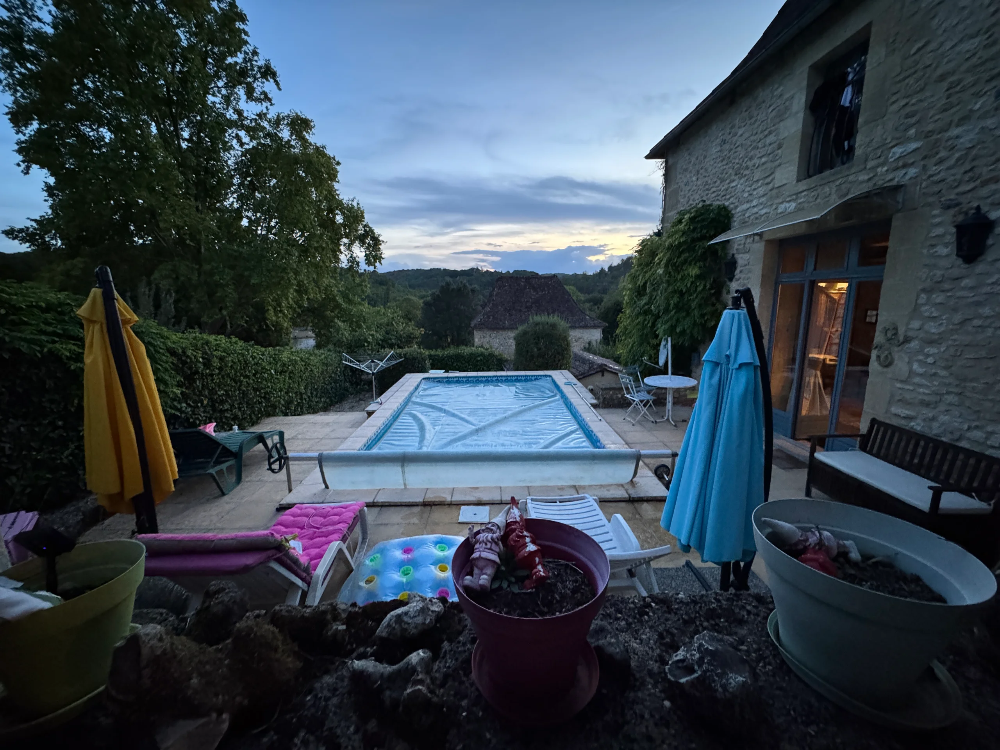
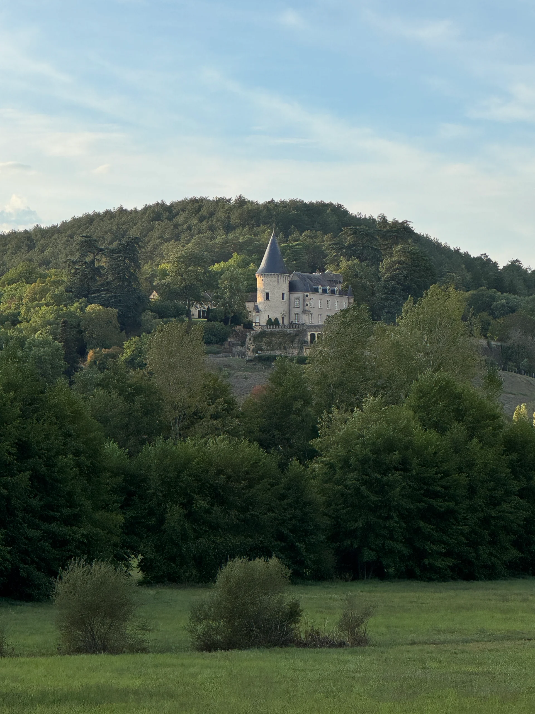

30 September-1 October 2026

A couple of nights out of the van at Graeme and Sandra’s house in Plazac within the Dordogne region.

Graeme was my best man and I have just been his some 36 years later.

Bubbles by the pool followed by a fast cycle to the very nice local campsite (Paradise) for happy hour with a bit too much wine with dinner later.

On the Wednesday  Denise and I went for a drive to Siorac a medieval town that was very busy with tourists then into Dome that sits high above the valley within an ancient valley. 

There are several prehistoric sites to visit including a troglodyte settlement in caves.

