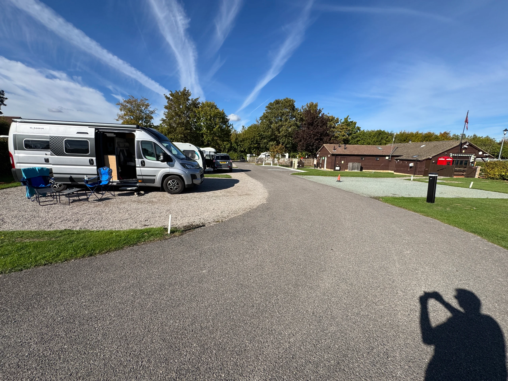
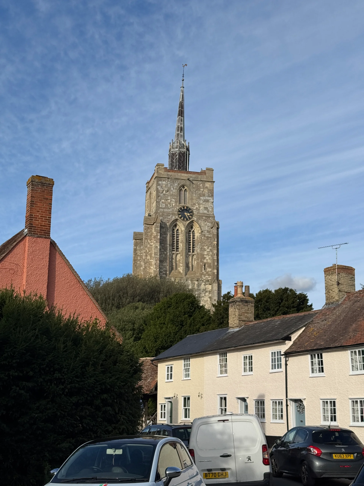
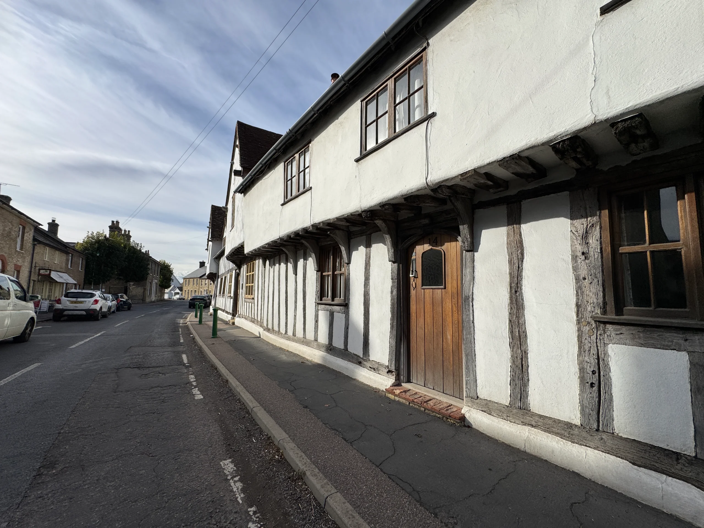

8-9 October 2026

Planned not to hi too far once crossed back into the UK. Got to LeShuutke 2 hours early and they offered us a train immediately. 

Very smooth and quick, drive off in the UK at 9:45 having boarded at 9:45 (BST v CET). With hindsight we could have gone much further up, but it’s dry and sunny and likely to be the last day like that, so exploring a small village (Ashfield) for the afternoon and dinner at a pub.

Nice little site with great showers and friendly staff.

